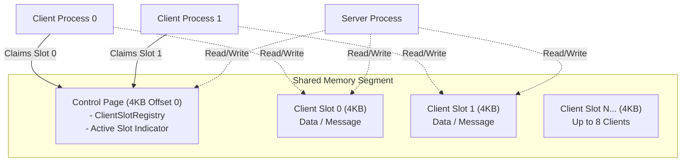
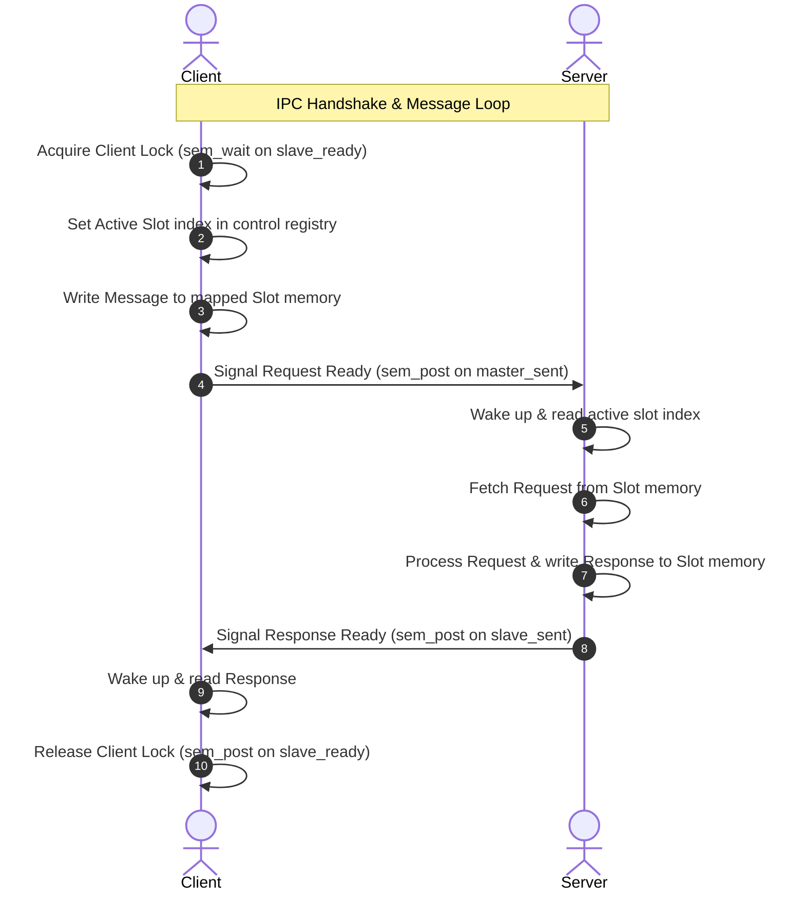

# Silber IPC Library

[](#platform-support)
[](#design-principles)
[](LICENSE)

**Silber** is a high-performance, lightweight, and exceptionally safe C++14 inter-process communication (IPC) library. It is designed for latency-critical applications that require ultra-fast, zero-copy bidirectional communication between a host server and multiple client processes using POSIX/Windows shared memory and semaphores.

> [!TIP]
> **Performance Benchmark:** Silber achieves an average round-trip latency of **~2.20 microseconds** (over 454,000 requests/sec) on modern CPU architectures using adaptive hybrid spin-locks.

---

## Key Features

* ⚡ **Ultra-Low Latency:** Incorporates a hybrid spin-lock (4000 spin iterations before falling back to OS semaphore sleeps) to maintain CPU cache warmth.
* 📦 **Zero-Copy & Zero-Allocation:** Direct memory-mapped file interaction allows passing structured messages without heap allocation.
* 🛡️ **Robust Resource Management:** Full RAII coverage cleans up shared memory mappings (`shm_unlink`) and OS semaphores (`sem_unlink`) safely, even during client process crashes.
* 🔒 **Crash Recovery Slot Registry:** Uses a thread-safe atomic lock-free slot allocator supporting up to 8 concurrent processes. Server auto-resets stale slots upon reboot.
* 🚫 **Exception-Free & No `exit()`:** Compiled with `-fno-exceptions` and guarantees zero abrupt exits, returning standard boolean flags or null pointers for error states.
* 🔌 **Decoupled Logger:** Decoupled console printing using a custom queryable/suppressible callback handler (`setSilberErrorCallback`).

---

## Memory Architecture

Silber maps a single segment of shared memory segmented into a control page and private process slots:



---

## Communication Protocol (3-Semaphore Flow)

Coordination is achieved using three OS semaphores (`m_slave_ready`, `m_master_sent`, and `m_slave_sent`):



---

## Usage Examples

### 1. Defining Custom Messages (Open/Closed Principle)
You can extend the library with your custom layouts without modifying the core files:

```cpp
#include "Message.h"

// Define a custom request structure
struct MessageCompareRequest : public Message
{
    MessageCompareRequest() : Message()
    {
        size = sizeof(MessageCompareRequest);
        type = MessageType::COMPARE_REQUEST;
    }
    char base_image_path[200];
    char target_image_path[200];
};

// Define a custom response structure
struct MessageCompareResult : public Message
{
    MessageCompareResult() : Message()
    {
        size = sizeof(MessageCompareResult);
        type = MessageType::COMPARE_RESULT;
    }
    int match_percentage;
};
```

### 2. Server Implementation
```cpp
#include "ServerProcCommunicator.h"

int main() {
    ServerProcCommunicator server("/shm_my_service");
    if (!server.isValid()) {
        std::cerr << "Failed to initialize server." << std::endl;
        return 1;
    }

    while (true) {
        // Wait blockingly (or adaptively spin) for incoming client request
        Message *req = server.receive();
        if (req && req->type == MessageType::COMPARE_REQUEST) {
            auto *comp_req = static_cast<MessageCompareRequest*>(req);
            
            // Process request...
            MessageCompareResult resp;
            resp.id = req->id;
            resp.match_percentage = 98;

            // Send reply to the client slot
            server.send(&resp);
        }
    }
    return 0;
}
```

### 3. Client Implementation
```cpp
#include "ClientProcCommunicator.h"

int main() {
    ClientProcCommunicator client("/shm_my_service");
    if (!client.isValid()) {
        std::cerr << "Failed to initialize client." << std::endl;
        return 1;
    }

    MessageCompareRequest req;
    req.id = 1;
    std::strcpy(req.base_image_path, "img1.png");
    std::strcpy(req.target_image_path, "img2.png");

    const MessageCompareResult *resp = nullptr;
    
    // Blocking request-response
    if (client.sendRequestGetResponse(&req, &resp)) {
        std::cout << "Match percentage: " << resp->match_percentage << "%" << std::endl;
    }

    // OR: Timed request-response with 100ms timeout
    if (client.sendRequestGetResponse(&req, &resp, 100)) {
        std::cout << "Match percentage: " << resp->match_percentage << "%" << std::endl;
    } else {
        std::cerr << "Request timed out!" << std::endl;
    }
    
    return 0;
}
```

---

## Platform Support

Silber has zero external dependencies and compiles directly on major platforms:

| Operating System | Compiler | Timing Mechanism | Tested Architecture |
| :--- | :--- | :--- | :--- |
| **Linux (Ubuntu 22.04+)** | GCC 9+ / Clang 12+ | `sem_timedwait` / `shm_open` | x86_64 / ARM64 |
| **macOS (13+)** | Apple Clang 14+ | Hybrid Wait / `shm_open` | ARM64 (Apple Silicon) |
| **Windows (10+)** | MSVC 2019+ | `WaitForSingleObject` | x86_64 |

---

## Performance Benchmarks

Measured over **100,000 round-trip messages** on modern hardware:

* **Average Latency:** `2.20 microseconds`
* **Throughput:** `454,208 requests/second`

---

## Design Principles

Silber strictly adheres to clean design conventions:
* **ISP:** No bloated synchronization structures. Only the active coordination semaphores are kept.
* **SRP:** Thread-safe Slot allocation is separated into [SlotRegistry](file:///Users/mba23/projects/silber/SlotRegistry.h).
* **DIP:** Underlying memory streams use decoupled abstract classes ([ISharedMemorySender](file:///Users/mba23/projects/silber/SharedMemorySender.h) / [ISharedMemoryReceiver](file:///Users/mba23/projects/silber/SharedMemoryReceiver.h)).
* **OCP:** Custom messages can be defined arbitrarily by users extending the base `Message` layout.

---

## License

This project is licensed under the **GNU Affero General Public License v3.0** (AGPLv3). See the [LICENSE](LICENSE) file for details.
